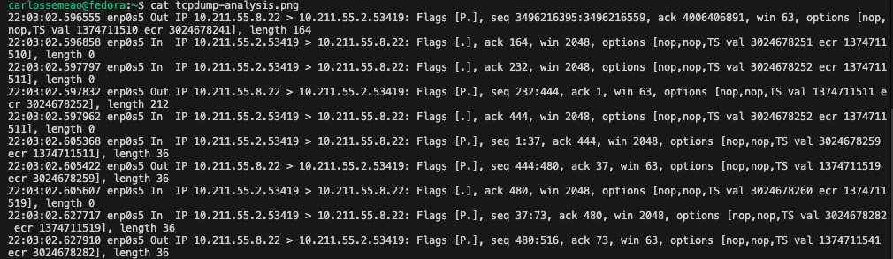
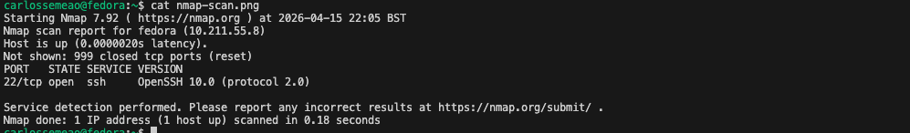

# Network Packet Analysis Labs

## Objective

This repository documents hands on labs built to strengthen practical understanding of network traffic analysis, packet capture and network discovery using real tools.

---

## Lab 1: SSH Traffic Analysis

### Scenario

Captured SSH traffic between macOS and a Fedora Linux VM.

### What I observed

- TCP connection established over port 22
- Continuous encrypted SSH packets
- No readable application data due to encryption

### Evidence


---

## Lab 2: HTTP Traffic Analysis

### Scenario

Captured HTTP traffic from a local Python web server.

### What I observed

- Readable HTTP requests:
  - GET / HTTP/1.1
- Server responses:
  - 200 OK
  - 404 Not Found (favicon)
- Full visibility of application layer data

### Evidence

See screenshots folder:
- http-analysis.png

---

## Key Insight

- SSH traffic is encrypted and not readable at packet level
- HTTP traffic exposes readable requests and responses
- Packet capture allows direct validation of network behaviour

---

## Tools Used

- tshark (Wireshark CLI)
- Fedora Linux
- macOS
- OpenSSH
- Python HTTP server

---

## Lab 3: Tcpdump Packet Capture and Filtering

### Scenario

This lab focused on using `tcpdump` from the Linux command line to capture, read, filter, and inspect packet data without relying on a graphical interface.

The goal was to strengthen practical understanding of how network traffic can be observed directly from the terminal and filtered efficiently by interface, host, port, protocol, and TCP flags.

### Objective

- Capture network traffic from a selected interface
- Save packet captures to `.pcap` files
- Read packet captures from file
- Apply practical filters to isolate specific traffic
- Inspect packets in numeric, ASCII, and hexadecimal formats
- Understand how `tcpdump` supports troubleshooting and protocol analysis from the command line

### Concepts Practised

- Interface selection with `-i`
- Writing captures to file with `-w`
- Reading captures from file with `-r`
- Limiting packet count with `-c`
- Disabling name resolution with `-n` and `-nn`
- Filtering by host, source host, destination host
- Filtering by port, source port, destination port
- Filtering by protocol such as ICMP, TCP, and UDP
- Combining conditions with `and`, `or`, and `not`
- Filtering TCP flags such as RST
- Displaying packets in brief, ASCII, hexadecimal, and hex + ASCII formats

### Commands Practised

#### Basic capture on an interface
```
tcpdump -i ens5
```
Captures packets on the selected interface.

#### Capture a limited number of packets without name resolution
```
tcpdump -i ens5 -c 5 -n
```
Captures five packets and displays numeric IP addresses without DNS lookups.

#### Save captured traffic to a file
```
tcpdump -i ens5 -w capture.pcap
```
Writes captured traffic to a .pcap file for later analysis.

#### Read packets from a saved capture file
```
tcpdump -r capture.pcap -n
```
Reads packets from a capture file without resolving addresses.

#### Capture SSH traffic
```
tcpdump -i any tcp port 22 -nn
```
Filters TCP traffic to or from port 22, typically SSH.

#### Filter traffic by host
```
tcpdump host example.com -w http.pcap
```
Captures traffic exchanged with a specific host.

#### Filter traffic by port
```
tcpdump -i ens5 port 53 -n
```
Captures DNS traffic on port 53.

#### Filter traffic by protocol
```
tcpdump -i ens5 icmp -n
```
Captures ICMP traffic such as ping requests and replies.

#### Filter packets from a source host in a pcap file
```
tcpdump -r traffic.pcap src host 192.168.124.1 -n
```
Displays packets from a specific source IP address.

#### Count packets matching a filter
```
tcpdump -r traffic.pcap src host 192.168.124.1 -n | wc
```
Useful for measuring how much traffic matches a condition.

#### Filter packets with only the TCP RST flag set
```
tcpdump -r traffic.pcap "tcp[tcpflags] == tcp-rst" -n
```
Useful for identifying reset behaviour in TCP communication.

#### Display brief packet information
```
tcpdump -r TwoPackets.pcap -q
```
Shows shorter output with less packet detail.

#### Display link-layer information such as MAC addresses
```
tcpdump -r TwoPackets.pcap -e
```
Useful for observing Ethernet layer details.

#### Display packet contents as ASCII
```
tcpdump -r TwoPackets.pcap -A
```
Useful when packet contents include readable text.

#### Display packet contents as hexadecimal
```
tcpdump -r TwoPackets.pcap -xx
```
Useful for lower level inspection when data is not human readable.

#### Display packet contents in hex and ASCII
```
tcpdump -r TwoPackets.pcap -X
```
Useful for comparing raw data and readable content together.

---

### Evidence



The screenshot shows live packet capture using tcpdump, filtering traffic by protocol and port directly from the Linux terminal.

This demonstrates the ability to inspect raw network traffic without relying on graphical tools, reinforcing command-line based analysis and troubleshooting skills.

---

## Lab 4: Nmap Network Discovery and Port Scanning

### Scenario

Executed Nmap from a Fedora Linux VM to perform host discovery and port scanning within a virtualised network environment. The scan was performed against the local VM (10.211.55.8), demonstrating services exposed by the VM itself, validating local network visibility and service enumeration techniques.

The lab included:
- Local host enumeration (self scan)
- Service detection on the VM
- Host discovery examples on both virtual and typical LAN ranges

### What I observed

- Live host discovery using ping scan (`-sn`)
- Open TCP ports identified on the target system
- Service detection revealing running services (e.g., SSH, HTTP)
- Differences between scan types:
  - Connect scan (`-sT`)
  - SYN scan (`-sS`)
- Impact of scan speed and timing options

### Key Findings

- Nmap automates host discovery and service enumeration efficiently
- Open ports directly reveal potential attack surfaces
- SYN scan is faster and more stealthy compared to full connect scan
- Port scanning provides a clear map of exposed services

### Evidence



The screenshot shows a real Nmap scan identifying open ports and services on a target system.

### Commands Practised

#### Discover live hosts (virtual network)
```
nmap -sn 10.211.55.0/24
```

#### Discover live hosts (real LAN example)
```
nmap -sn 192.168.1.0/24
```

#### Fast scan of common ports
```
nmap -F MACHINE_IP
```

#### SYN scan (stealth)
```
sudo nmap -sS MACHINE_IP
```

#### Service version detection
```
nmap -sV MACHINE_IP
```

#### Scan all ports
```
nmap -p- MACHINE_IP
```

#### Save scan results
```
nmap -oA scan_results MACHINE_IP
```

## Conclusion

This work demonstrates practical network visibility across three key layers:

- Traffic capture (tcpdump)
- Packet analysis (tshark)
- Network discovery and service enumeration (Nmap)

Instead of relying on assumptions, these labs validate network behaviour directly at packet level.

Together, these tools form a complete workflow: discover → capture → analyse.

These techniques mirror workflows used in network troubleshooting, security analysis and incident investigation.